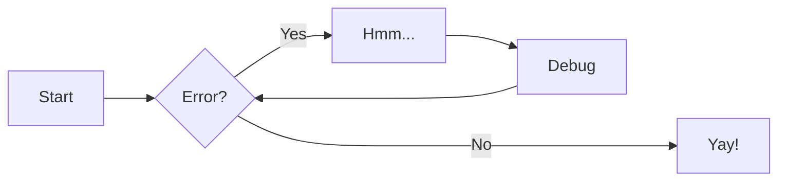

# TPR-DB-documentation
This is a repository used to generate a static site containing all documentation for the CRITT Translation Process Research Database (TPR-DB). The static site is generated from [markdown](https://www.markdownguide.org/getting-started/) files using a tool called [zensical](https://zensical.org/).

## Contributing

If you have never used Git or GitHub before, follow every step below carefully. For full *zensical* documentation visit [zensical.org/docs/](https://zensical.org/docs/).

---

### Step 1 - Fork the repository

1. Make sure you are signed in to [GitHub](https://github.com).
2. Go to the top of this page and click the **Fork** button (top-right corner).
3. Click **Create fork**. This creates your own personal copy of the repository under your GitHub account.

---

### Step 2 - Clone your fork to your computer

Cloning downloads the repository so you can edit files locally.

Open a terminal (**Terminal** on Mac, **PowerShell** on Windows) and run:

On **Mac**:
```bash
git clone https://github.com/YOUR-USERNAME/TPR-DB-documentation
cd TPR-DB-documentation
```

On **Windows**:
```powershell
git clone https://github.com/YOUR-USERNAME/TPR-DB-documentation
cd TPR-DB-documentation
```

**Remember** to replace `YOUR-USERNAME` with your GitHub username :cowboy_hat_face:

> [!TIP]
> If you don't have Git installed, download it from [git-scm.com](https://git-scm.com/downloads) first.

---

### Step 3 - Activate the virtual environment

This project uses a Python virtual environment that already has all the required tools installed.

On **Mac**:
```bash
source venv/bin/activate
```

On **Windows** (PowerShell):
```powershell
venv\Scripts\Activate.ps1
```

You will know it worked when you see `(venv)` appear at the start of your terminal prompt.

---

### Step 4 - Preview the site locally

Run the local development server so you can see your changes in a browser as you work:

```bash
zensical serve
```

Then open [http://localhost:8002](http://localhost:8002) in your browser. The page will automatically reload whenever you save a file.

> [!NOTE]
> Sometimes, if the page is behaving strangely in your browser, you may need to press `CTRL + C` to stop the development server and then rerun `zensical serve` to restart it.

When you are done, press `CTRL + C` to stop the server.

---

### Step 5 - Make your edits

> [!WARNING]
> **Keep Links Permanent** Do **NOT** change the names of the directories or markdown files within the `docs` directory!

> [!IMPORTANT]
> Only edit `.md` files inside the `docs/` directory. Do not rename, move, or delete any files or folders — see the warning above.

Open any `.md` file in the `docs/` folder with a text editor and make your changes. Save the file when you are done.

---

### Step 6 - Commit your changes

Once you are happy with your edits, tell Git to save a snapshot of them:

```bash
git add .
git commit -m "Brief description of what you changed"
```

---

### Step 7 - Push your changes to GitHub

Send your committed changes back up to your fork on GitHub:

```bash
git push origin main
```

---

### Step 8 - Open a pull request

1. Go to your fork on GitHub (`https://github.com/YOUR-USERNAME/TPR-DB-documentation`).
2. You should see a banner saying **"This branch is ahead of..."** — click **Contribute** → **Open pull request**.
3. Add a short title and description explaining what you changed and why.
4. Click **Create pull request**.

That's it! A maintainer will review your contribution and merge it if everything looks good.

---

### Step 9 - Keep your fork up to date

Over time, the official repository may receive changes from other contributors. Run these commands occasionally to keep your fork and local `main` branch in sync:

```bash
# only run this command once per local clone
git remote add upstream https://github.com/Critt-Kent/TPR-DB-documentation
# run rest of commands every time you want to update
git fetch upstream
git switch main
git merge upstream/main
git push origin main
```

> [!TIP]
> You only need to run `git remote add upstream ...` once per local clone. After that, just run the other commands when you want to sync.

### Zensical Markdown Guide (very brief)

#### Headers

```
# H1 Header
## H2 Header
### H3 Header
#### H4 Header
##### H5 Header
###### H6 Header
```

#### Text formatting

```
**bold text**
*italic text*
***bold and italic***
~~strikethrough~~
`inline code`
```

#### Links and images

```
[Link text](https://example.com)
[Link with title](https://example.com "Hover title")


```

#### Lists

```
Unordered:

- Item 1
- Item 2
  - Nested item

Ordered:

1. First item
2. Second item
3. Third item
```

#### Blockquotes

```
> This is a blockquote
> Multiple lines
>> Nested quote
```

#### Code blocks

````
```javascript
function hello() {
  console.log("Hello, world!");
}
```
````

#### Tables

```
| Header 1 | Header 2 | Header 3 |
|----------|----------|----------|
| Row 1    | Data     | Data     |
| Row 2    | Data     | Data     |
```

#### Horizontal rule

```
---
or
***
or
___
```

#### Task lists

```
- [x] Completed task
- [ ] Incomplete task
- [ ] Another task
```

#### Escaping characters

```
Use backslash to escape: \* \_ \# \`
```

#### Line breaks

```
End a line with two spaces  
to create a line break.

Or use a blank line for a new paragraph.
```

### More Complex Markdown Guide

#### Admonitions

> Go to [documentation](https://zensical.org/docs/authoring/admonitions/)

```
!!! note

    This is a **note** admonition. Use it to provide helpful information.

!!! warning

    This is a **warning** admonition. Be careful!
```

##### Details

> Go to [documentation](https://zensical.org/docs/authoring/admonitions/#collapsible-blocks)

````
??? info "Click to expand for more info"

    This content is hidden until you click to expand it.
    Great for FAQs or long explanations.
````

#### Code Blocks

> Go to [documentation](https://zensical.org/docs/authoring/code-blocks/)

``` python hl_lines="2" title="Code blocks"
def greet(name):
    print(f"Hello, {name}!") # (1)!

greet("Python")
```

1.  > Go to [documentation](https://zensical.org/docs/authoring/code-blocks/#code-annotations)

    Code annotations allow to attach notes to lines of code.

Code can also be highlighted inline: `#!python print("Hello, Python!")`.

#### Content tabs

> Go to [documentation](https://zensical.org/docs/authoring/content-tabs/)

````
=== "Python"

    ``` python
    print("Hello from Python!")
    ```

=== "Rust"

    ``` rs
    println!("Hello from Rust!");
    ```
````

#### Diagrams

> Go to [documentation](https://zensical.org/docs/authoring/diagrams/)



#### Footnotes

> Go to [documentation](https://zensical.org/docs/authoring/footnotes/)

Here's a sentence with a footnote.[^1]

Hover it, to see a tooltip.

[^1]: This is the footnote.


#### Formatting

> Go to [documentation](https://zensical.org/docs/authoring/formatting/)

```
- ==This was marked (highlight)==
- ^^This was inserted (underline)^^
- ~~This was deleted (strikethrough)~~
- H~2~O
- A^T^A
- ++ctrl+alt+del++
```

#### Icons, Emojis

> Go to [documentation](https://zensical.org/docs/authoring/icons-emojis/)

* :sparkles: `:sparkles:`
* :rocket: `:rocket:`
* :tada: `:tada:`
* :memo: `:memo:`
* :eyes: `:eyes:`

#### Maths

> Go to [documentation](https://zensical.org/docs/authoring/math/)

$$
\cos x=\sum_{k=0}^{\infty}\frac{(-1)^k}{(2k)!}x^{2k}
$$

> [!NOTE]
> In Zensical, MathJax must be included via a `script` tag and is not configured in the generated default configuration to avoid including it in pages that do not need it. See the documentation for details on how to configure it on all your pages if they are more Maths-heavy than these simple starter pages.

#### Task Lists

> Go to [documentation](https://zensical.org/docs/authoring/lists/#using-task-lists)

* [x] Install Zensical
* [x] Configure `zensical.toml`
* [x] Write amazing documentation
* [ ] Deploy anywhere

#### Tooltips

> Go to [documentation](https://zensical.org/docs/authoring/tooltips/)

[Hover me][example]

  [example]: https://example.com "I'm a tooltip!"