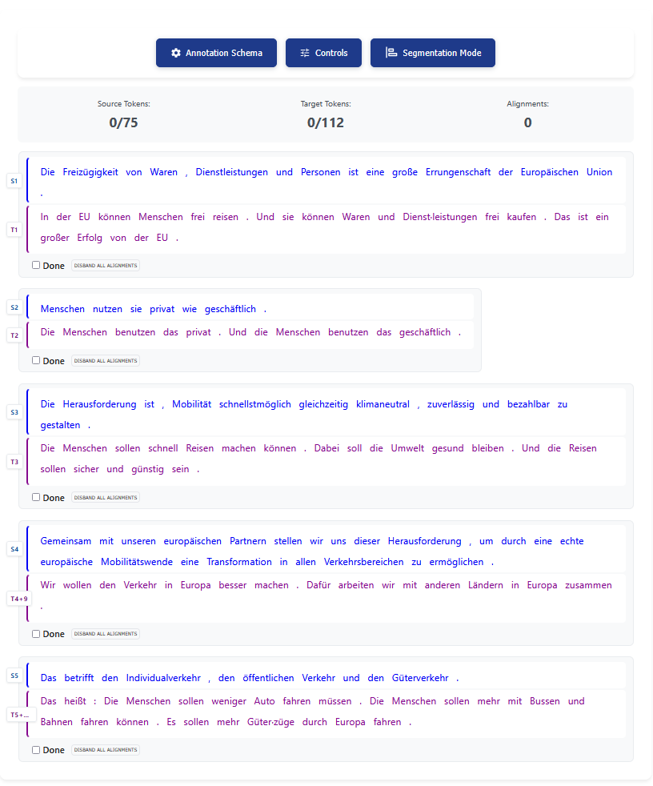

# Manual Alignment

!!! info
    Before you start manually aligning tokens in your study sessions, you should first make sure that the Source Text (ST) and the Target Text (TT) have been segmented by the ``` Alignment Module  ``` correctly. If that is not the case, you have to make manual corrections. You can read more about that on the page #Edit Segmentation.

The TPR-DB 3.0 allows you to put the various cognitive processes taking place either on the ST or on the TT during translation in relation to each other. To achieve this, a Graphic User Interface has been developed. 

## Getting started

Choose the study you wish to work on and open the study sessions. It should look something like this:


Pick a session and click on "Open Aligner".

A new window opens displaying your segmented study session. You cannot continue here from here, unless you have finished segmneting your study session, as explain in [Edit Segmentation](segmentation.md). In here you can align individual tokens that are already placed within the correct segments. You should see something similar to this:



## Start Aligning

By clicking on the middle blue button labeled "Controls" near the top you are prompted with a pop-up window explaining the controls and key binds you will use to adjust the alignment.

| Action | Mouse | Keyboard |
|----------|----------|----------|
| Navigation    | move mouse     | tab for segment pairs, ← ↑ ↓ → for  tokens      |
| Select/Deselect Tokens    | left click     | A     |
| Seal Alignment Group    | right click     | S     |
| Error Annotation    | left click in Options Menu     | Use category hotkeys in Options Menu     |
| Save Alignments    | left click Save Alignments or Retry Save     | ctrl + Enter or command + return     |
| Focus Save Panel    | n/a     | alt + Enter or option + return     |
|Undo last action    | n/a     | ctrl + Z  or command + Z     |
| Minimize / maximize save panel   | Click the minus button (minimize) or plus button (maximize).     | ctrl + shift + M  or command + shift + M     |

Additionally, from within the Controls-window, you can change the orientation settings of the ST and TT: You can either have the St at the top and the TT below or the ST left and the TT right (as it was in YAWAT).

!!! info
    The way the text is displayed is purely up to you. It makes no difference for the further fuctionality of the Alignment Editor.

By using your mouse and/or keyboard you thus select and align equivalent ST- and TT-tokens. 

!!! warning
    Beware: How you align the ST to the TT has a big impact on your future analysis. in TPR-typical fashion you need to align as fine-grained and holistically as possible. This means that you favor 1:1 word alignments, wherever possible, over 1:n (or n:n) word alignments. Furthermore, you should align as many tokens as possible to reduce data loss in your further analysis. You can read more about the impact of alignemnt [here](https://www.degruyterbrill.com/de/document/doi/10.1075/ata.xx.10gil/html "Impact of word alignment on word translation entropy and other metrics").