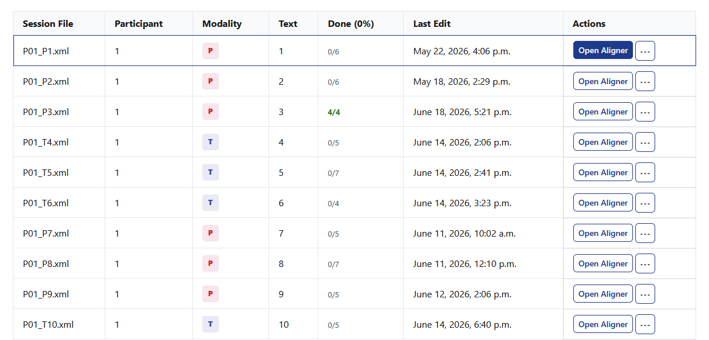
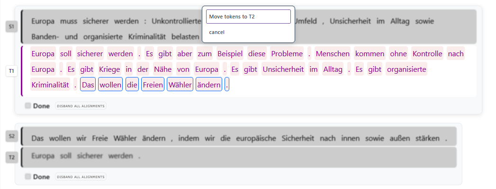
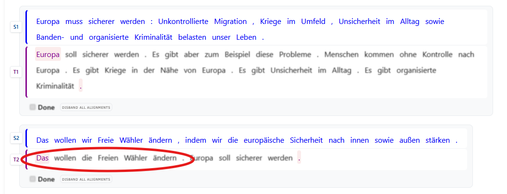
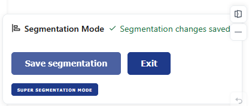
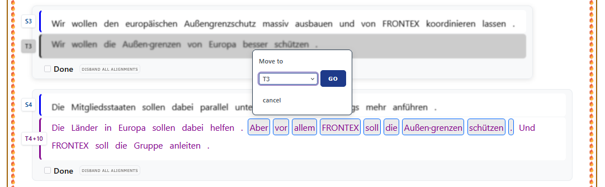
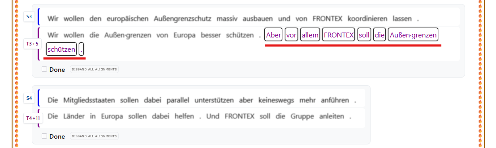

# Edit Segmentation

> Perhaps the most fundamental question [...] is to determine the mechanisms underlying the production of translations which are common to all translators. (Carl, Banaglore, Schaeffer 2016: 4 ).

With this phrase in the beginning of their book, the authors expand on the paradigm shifts in Translation Studies; from prescriptive, to descriptive to *predictive*. The TPR-DB, as the speerhead of the most recent paradigm shift, has been therefore empirically studying the various cognitive processes during translation: From reading of the source text (ST), to processing and translating, to typing and proofreading of the Target Text (TT) and everything in between. The real innovation has been the ability to not just observe these processes in isolation but to put them all in relation to each other to more accuretely draw the map of the cognitive architecture during translation.

In order to do that, you first need to verify that the ``` Alignment Module  ```  has produced acceptable results.

!!! info "Automatic Segment Alignment"
    You can read more about how the automatic segment alignment module works in the [Segment-level Alignment section of the TPR Pipeline page](../process/automatic-processing.md#segment-level-alignment).
    
By aligning  ST- and TT-sentences in segments, so-called alignments groups, you make some basic assumptions regarding equivalence: The meaning in the ST-side of the segment is equivelent to the TT-side. In other words: A translator read an ST-sentence during translation and thus produced an equivalent sentence. It is now up to you as a researcher, to put these two sentences in one segment/alignment group. This eventually allows you to put the underlying cognitive processes that took place during reading and typing in relation to each other.

## Getting started

Choose the study you wish to work on and open the study sessions. It should look something like this:



Pick a session and click on "Open Aligner".

A new window opens. In here you can align individual tokens that are already placed within the correct segments. This will be explained on the page #ManualAligment. 

The header displays the basic information about the current study session. Scrolling further down you see three blue buttons "Annotation Schema", "Controls" and "Segmentation Mode". Further below you see your study texts and the translation of the participant as segmented by the ``` Alignment Module  ```. You need to check if the correspondent equivalent ST- and TT-sentences are places in the same segment. Often times, the TT contains more sentences than the ST.

!!! warning
    When one language side contains more segments than the other, all remaining segments are collapsed into the final alignment group. 

If this happens or you spot any TT tokens that are translations of tokens of another ST-segment than the segment they are currently placed in, then the segmentation is incorrect. In order to correct it and place the tokens in the right segment, click on "Segmentation Mode".

## Segmentation Mode

Once you have clicked on "Segmentation Mode" you are prompted with a pop-up window explaining the controls and key binds you will use to adjust segmentation. 

!!! info "Quality of Life"
    An innovation and quality-of-life imporvement in TPR-DB 3.0 is that you no longer need external ressources (such as Cygwin, perl-scripts etc.) to adjust the segmentation. This cuts down the time you allot to correcting your segmentation dramatically. Furthermore, you no longer need to repeatedly upload and download .atag-files. All you need is the Segmentation Mode editor in TPR-DB 3.0.
    

You can now use keyboard shortcuts to navigate, select, move and confirm segments:

| Action | Mouse | Keyboard |
|----------|----------|----------|
| Navigate segmentation targets | Click a source segment, then click an eligible target token. | tab moves between segment pairs and source segments. ← ↑ ↓ → move between source segments and eligible target tokens.      |
| Open source move options    | Click a source segment once.     | Press Enter on a source segment.      |
| Open target move options    | Click the first or last target token to anchor selection, then click another token in that segment. To select a range: left-click one token, then right-click or shift-click another token in the same segment.  | Press Enter on the first or last target token to anchor, then press Enter again on another token in that same segment. To select a range: press Enter to anchor, then press Shift+Enter on another token in the same segment.      |
| Focus Save Panel    | n/a     | alt + Enter or option + return     |
| Revert changes    | Click revert unsaved changes in the save panel.    | Focus the save panel with alt + Enter (or option + return), then tab to and press the revert button.      |
| Undo last action    | n/a     | ctrl + Z or command + Z     |
| Minimize / maximize save panel    | Click the minus button (minimize) or plus button (maximize).     | ctrl + shift + M or command + shift + M     |

Segmentation Mode allows you to select any number of tokens from the beginning or the end of the segment and move them one segment up or one segment down accordingly. 




In the example above, the TT-tokens "Das wollen die Freien Wähler ändern." in TT segment 1 have been selected by first clicking on the last period of that sentence and then on the article "Das". This leads to the selection of that entire sentence. Of course, you can also use the key binds. You are then prompted to choose what to do with your selection. As the selected tokens are at the end of TT segment 1, you can only move them down to the following segment, i.e. TT segment 2. By clicking on "Move tokens to T2", the program moves your selection down, as shown in the next image.




You continue selecting and moving tokens up and down until you have the equivalent ST- and TT-sentences in the same corresponding segments.

!!! tip "Saving"
    You can save your finished segmentation by clicking on "Save segmentation" on the pop-up window on the lower right corner of your screen. However, you do not need to save your segmentation after every movement. Saving once at the end (after you have made all your changes) is sufficient.

Segmentation Mode excels at correcting minor errors that the ``` Alignment Module  ``` makes. Note that the order of the tokens of the TT remains unchanged; mere the assignment to an alignment group changes. In some cases, you will need to change the order of the TT tokens. The reasons for that can be plethora: For instance, the translator changed the original order of the pieces of information in the TT. Perhaps the translation of a sentence that is in the very beginning of the ST has been written so that it is in the very end of the TT. Alternatvely, the translator added, omitted or summarized information and you need to move the tokens into different segments, thus breaking up the  TT completely. Segmentation Mode was not designed to reflect a non-chronological restructuring of the TT. Luckily, TPR-DB 3.0 offers a powerful tool to deal even with the most difficult situations.

## Super Segmentation Mode

The underlying premise of Segmentation Mode (and of many translation tools) is that each sentence of the TT is placed in the same exact order as the sentences of the ST. But depending on the skopos, domain, styleguides etc., translators may choose to change the order of the information presented in the TT to meet their communicative needs. Thus, the order of the pieces of information of the TT may not be the same as in the ST. With Super Segmentation Mode you can move any token (irrespective of its position) to any other segment. Threfore, you can put equivalent ST- and TT-tokens in the same alignment group.

To enter Super Segmentation Mode you first need to save all changes you may have done in Segmentation Mode.



To enter Super Segmentation Mode, save all changes in Segmentation Mode first and then click on "Super Segmentation Mode" in the pop-up window on the lower right corner of your screen.

Again, you will be prompted with a pop-up window explaining the controls of Super Segmentation Mode.

| Action | Mouse | Keyboard |
|----------|----------|----------|
| Navigate target tokens    | Move the mouse over tokens in any target segment.     | tab moves between segment pairs. ← ↑ ↓ → move between target tokens.      |
|Select / deselect a token    | Click an unaligned target token. Click again to deselect.     | Press Enter on an unaligned target token.      |
| Select a range of tokens    | Left-click to anchor, then right-click or Shift+click another token in the same segment.      | Press Enter to anchor, then press Shift+Enter on another token in the same segment.      |
| Choose destination and move    | Select one or more tokens, then pick a destination segment from the popover and click Go.     | After selecting tokens, tab into the popover, choose a destination segment, then press Enter on Go.      |
| Cancel selection    | Click the cancel button in the popover, or click an empty area.     | Press Esc.      |
| Save move    | Click Save super segmentation in the save panel.     | ctrl + Enter     |
| Focus Save Panel    | n/a     | alt + Enter or option + return     |
|Revert or exit    | Click revert unsaved changes to undo the staged move, or click Exit Super Segmentation Mode.     | Focus the save panel with alt + Enter (or option + return), then tab to and press the revert button.      |
| Undo last action    | n/a     | ctrl + Z or command + Z     |
| Minimize / maximize save panel    | Click the minus button (minimize) or plus button (maximize).     | ctrl + shift + M or command + shift +  M     |


!!! warning "With great power comes great responsibility"
    This is a very powerful tool that has been specifically designed for TPR DB 3.0. In Super Segmentation Mode you can move any number of tokens of any TT segment to any other TT segment. It inherently changes the order of the Token-IDs, produced by the ``` Alignment Module  ```. Be sure to **first** make all possible changes in Segmentation Mode **before** you make any changes through Super Segmentation Mode. Otherwise you risk effects that can only be reverted by deleting and re-uploading the session in question.

In the following example, the tokens "Aber vor allem FRONTEX soll die Außen·grenzen schützen" are in the middle of TT-segment T4+10. They need to be moved however to T3. This is not possible in Segmentation Mode, as you can only select tokens from the beginning or the end of a segment, not in the middle. After selecting the desired tokens by left-click to anchor, then right-click or Shift+click another token in the same segment, you select the destination from the drop-down menu and clik GO. 



Then your selection is moved to the desired destination:


!!! note "Target Segment Number Changes"
    Notice how the name of the TT-segments has changed after the movement. This is by design and fuctions as a safeguard to ensure normal functionality after having changed the order of the tokens. 

!!! warning
    Unlike Segmentation Mode, you now need to click on "Save Super Segmentation" after every change in order to proceed and make more changes.

You continue selecting and moving tokens to the desired positions until you have the equivalent ST- and TT-sentences in the same corresponding segments. When you are done, click on "Exit Super Segmentation Mode" to return to Segmentation Mode. You can then start aligning individual tokens (and therefore the underlying process data) in the Aligment Tool, which will be explained in the page #ManualAlignment.