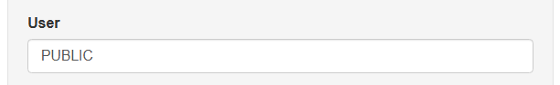
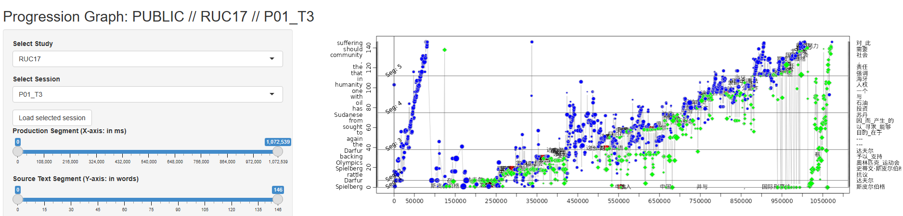
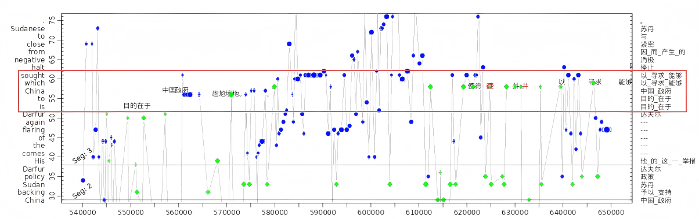
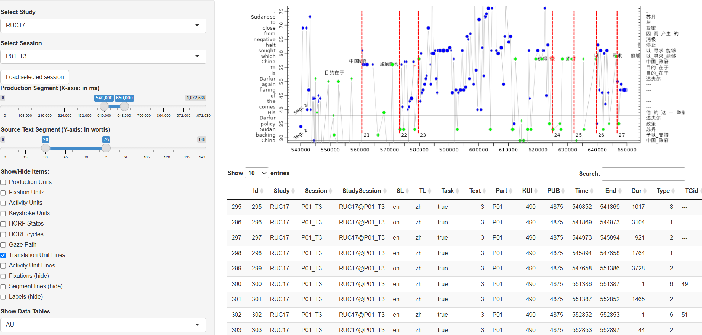

# Utilities

## `tprdb-utilities` (Python Library)

The Python library `tprdb-utilities` ([Python Package Index](https://pypi.org/project/tprdb-utilities/) | [GitHub Repo](https://github.com/Critt-Kent/tprdb-utilities)) is a library that makes it easy to fetch data tables from specific TPR-DB studies and then read them into Pandas DataFrames for analysis.

### `fetcher`

The `fetcher` module and its **`fetch_TPRDB_tables()`** function works with the [TPR-DB web app](https://critt.as.kent.edu/tpr/)'s API to download/update data tables for a specific TPR-DB study, saving the most up-to-date tables in a location of your choosing.

!!! tip "Why fetch?"

    If you need to analyze the data from a location other than the CRITT TPR-DB Jupyter server, this module/function makes it **super easy to download and organize the data tables** 🤓

### `reader`

The `reader` module and its **`read_TPRDB_tables()`** function takes the data tables you have downloaded for one or more studies you specify and reads them into a Pandas DataFrame object for subsequent analysis.

If working directly from the CRITT TPR-DB Jupyter server, the same module/function will also read the data directly from where the TPR-DB stores it.

### `transformer`

The `transformer` module contains utility functions that will *transform* your data in various ways:

* **`prep_parallel_texts()`**: this function prepares bitexts (source text and the target text of one participant) and/or tritexts (source text and the target texts of two participants), organized by segment, so that you can, for example, run automatic quality evaluation metrics like BLEU and COMET.
* **`recompute_pause_based_metrics()`**: this function will compute pause-based metrics (typing bursts (**TB**), typing gap (**TB**), and typing duration (**TD**))—calculated using a custom pause threshold you provide—and add them to your Segments DataFrame (based on SG tables)

## Progression Graphs
Translation progression graphs are one of several methods for visualizing data from different tables. It depicts the temporal dynamics of the translation process by concurrently plotting partial information extracted from multiple unit tables.

Progression graphs are implemented using `ShinyR`, which is based on a reactive programming model. As a result, plots and tables are automatically updated whenever you change an input. The progression graph interface can be accessed [here](https://critt.as.kent.edu/shiny/ProgGraph/).

### Generating translation progression graphs
The following are the steps for generating a progression graph. 

First, you need to specify the user. The default **User** is *PUBLIC*, which provides access to a variety of public studies. To generate progression graphs for your private studies, change the user name to your own in the left panel.

Then use the drop-down menus to **Select Study** and **Select Session**, after which click **Load selected session**.

For demonstration purposes, we use session P01_T3 from the public study RUC17.

!!! note
 
    ·x-axis: time window (in milliseconds) 

    ·y-axis: range of the ST and their aligned TT (in words)

    ·blue dots: fixations on the source text

    ·green dots: fixations on the target text

At this stage, the graph provides a general overview of the translator's behavior. Here, the x-axis represents the entire translation duration. The translator initially reads through the ST before beginning to produce the TT. Toward the end of the translation process, fixations are primarily on the TT, suggesting that the translator is reviewing the translation.

To set the time window and ST range, use the sliders to select the desired **Production Duration** and **Source Text Segments**.

For this example, the time window is set to 540,000–650,000 ms and the ST range to words 30–75. The resulting progression graph is shown below. 

!!! note

    ·black characters: insertions
    
    ·red characters: deletions

By narrowing the time window and the ST range, the graph provides a finer-grained view of the translator's activity, showing that the translator focused on translating the words within the red boxed area, with a few deletions.

A useful complement to the progression graph is the set of data tables. To view a specific table, select it from the drop-down menu under **Show Data Tables**, where you can review different features. For detailed descriptions of the features, please refer to [Table features in TPR-DB 3.0](https://critt-kent.github.io/TPR-DB-documentation/analyze/features/).

You can also customize the progression graph by selecting **Show/Hide Items** from the left panel to highlight specific features.

The progression graph above displays the TU lines (as shown by the red dashed line). Within the selected time window, there are six complete translation units (TUs 21–26). The table provides detailed AU features.