# Converting keylogging data from Trados to Translog
This guide provides step-by-step instructions on how to convert Trados keylogging data into a Translog-compatible format, which can then be uploaded to TPR-DB.

## 1. Why Trados?
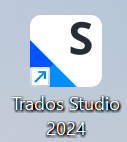

Although Translog enables the recording of the keylogging activity, it cannot provide professional translation features like translation memory (TM) which are essential in the professional translation industry. SDL Trados Studio, on the other hand, combines automation, consistency and collaboration tools, thus being a common software used in handling modern translation workflows. Therefore, implementing Trados in TPR can greatly improve experimental ecological validity. 

!!! note

    To enable data analysis in TPR-DB, Trados keylogging data must be converted into the Translog XML format. A key component of this conversion is the Trados plugin Qualitivity.

## 2. Qualitivity
Qualitivity is a Trados plugin that captures productivity and quality data in real time during translation and post-editing tasks, including keystrokes, pauses, and timestamps. After task completion, it generates detailed reports on the time spent and the changes made throughout the translation process. These reports can be used to measure productivity, for example by analyzing the total time spent and typing speed (words per minute), as well as to assess translation quality by examining editing patterns and comparing different translation workflows.

### Step 1 — Download Qualitivity
[Download link](https://appstore.rws.com/plugin/16)

!!! note

    Select the version compatible to your Trados Studio version. 
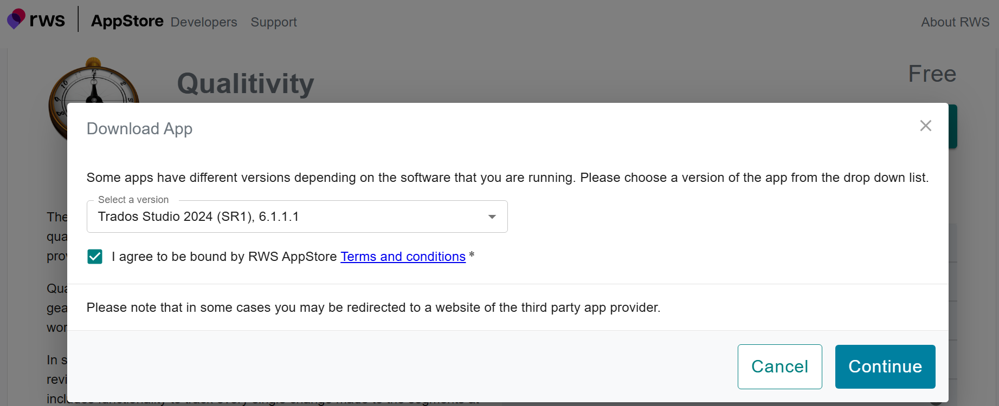

### Step 2 — Installation
After downloading the plugin, double-click it to begin the installation.
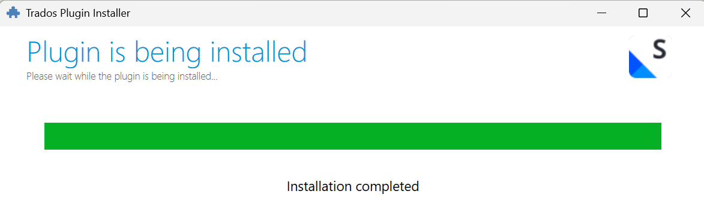

## 3. Work in Trados
A Chinese-to-English translation task created as a local project is used for demonstration.

### Step 1 — Create a local project
1. Open **Trados Studio**

2. Select **File → New → New Local Project**
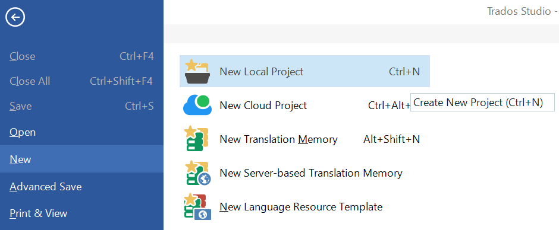

3. Set the **Project Name**, **Source Language**, and **Target Language**, and upload the file you will work on. Then click **Next** to proceed through the steps for configuring translation resources and termbases. For demonstration purposes, we simply continue clicking **Next** to complete the project setup.
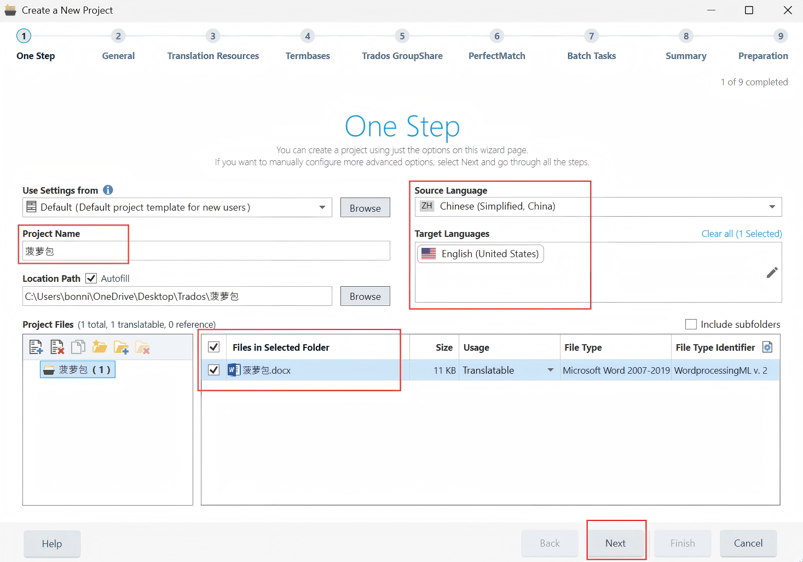

### Step 2 — Work on the project
1. Double click on the project to start the task. Qualitivity automatically records user activity in the background once you open the project.
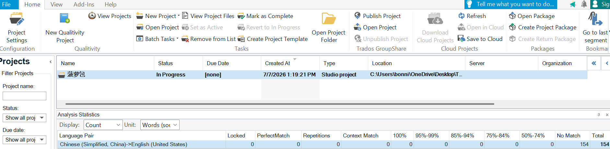

2. The source text is displayed in the left column. Enter the translation in the right column.
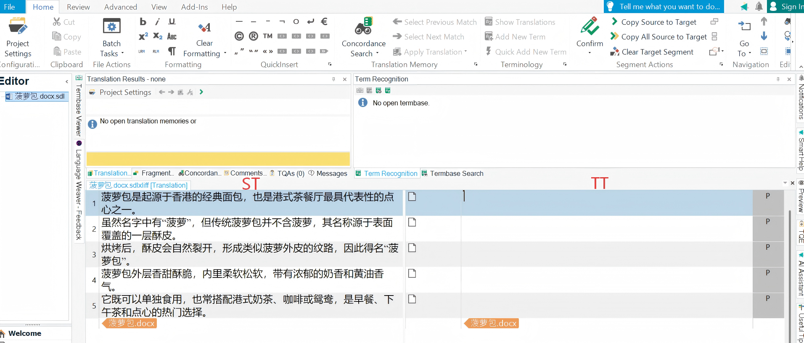

3. After completing the project, click **Close Document (the x icon)** in the upper-right corner of the project interface.
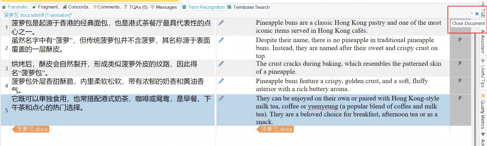

4. A warning dialog will pop up. Click **Yes** to close the project.
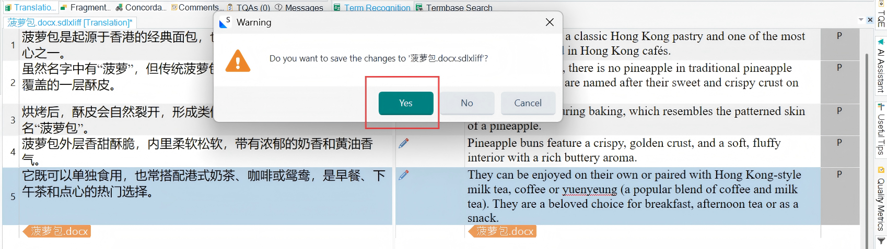

## 4. Convert Qualitivity data into a Translog-compatible format

### Step 1 — Export Qualitivity activities
1. Go to the **Qualitivity** panel on the left, where the project will be listed. Right-click the project and select **Export Activities**.
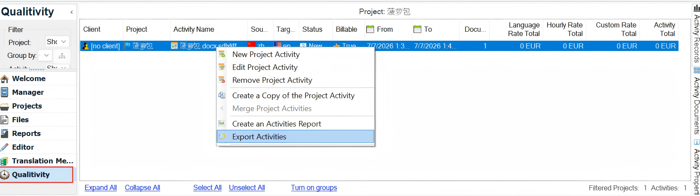

2. In the export interface, check **View report after the file has been created** and **Include keystroke data**, and select **Export to XML format**. Click **OK**, and the Qualitivity report will open automatically.
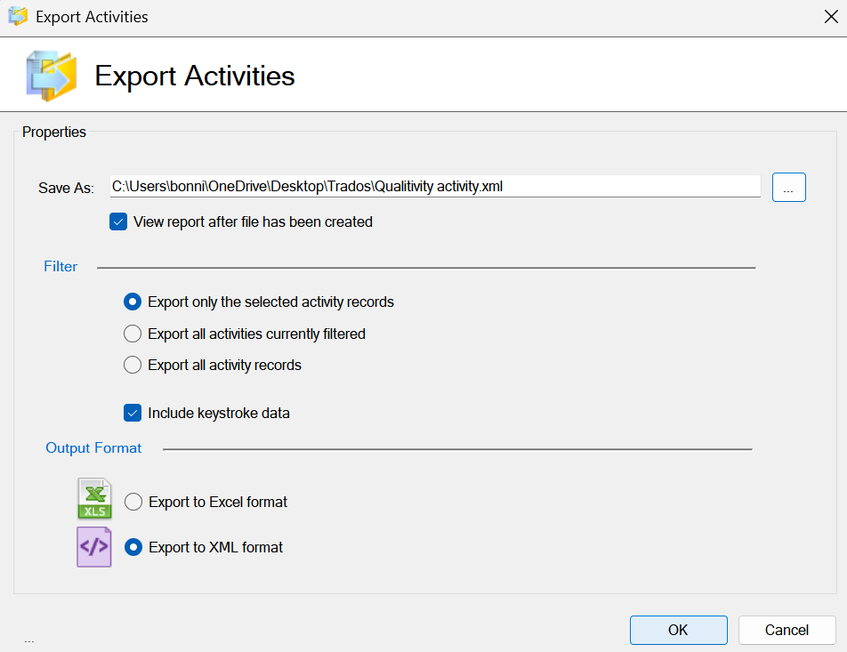

### Step 2 — Inspect the XML file
The keylogging data has now been converted from the Trados format to the Translog-II format. You can view the keystroke recorded at each timestamp in the resulting XML file, which is also ready for upload to TPR-DB.
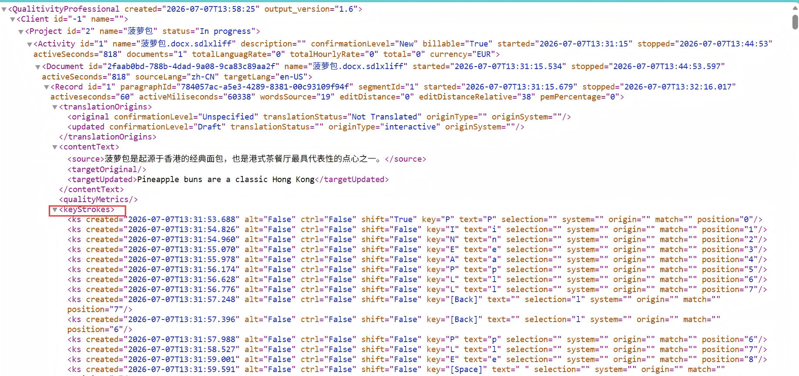

