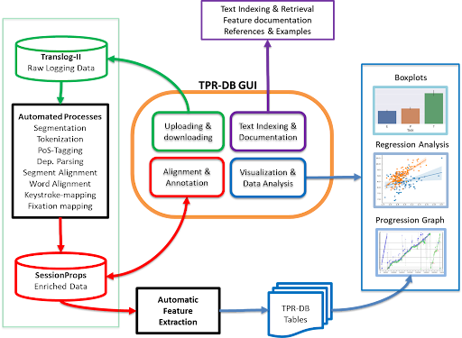

# The CRITT TPR-DB 3.0

!!! info inline end "version 3.0"

    This is the documentation site for the CRITT TPR-DB version 3.0.

The Center for Research and Innovation in Translation and Translation Technology ([CRITT](https://sites.google.com/site/centretranslationinnovation/home)) is the creator and maintainer of the Translation Process Research Database (TPR-DB), which is now in its 3rd major version (3.0).

## What is the TPR-DB?

The Translation Process Research Database (TPR-DB) is a tool for processing key-logging and gaze-fixation data so that it can be easily analyzed in powerful and flexible ways.

<figure markdown="span">
  { width="800" }
  <figcaption>How the TPR-DB Works</figcaption>
</figure>

## History

The CRITT Translation Process Research Database (TPR-DB) project started around 2010 with the data from a number of translation process studies that were recorded in Translog[^1] and integrated into a database under a common format. The TPR-DB was first a part of the Danish Dependency Treebanks Project at the Copenhagen Business School[^2] and then became a project on its own. Right from the beginning the idea was not only to provide a data repository for TPR, but also to provide a toolkit for the analysis and visualization of the data. The TPR-DB toolkit started out with a number of functions in R to access and analyse the TPR-DB data, and subsequently developed into a browser-based toolkit with Jupyter interface and a Python library.

The first public documentation of the CRITT TPR-DB 1.0 appeared in 2012 ([Carl 2012](https://aclanthology.org/2012.amta-wptp.1.pdf)), when Translog-II was amended to record non-European languages (Chinese, Hindi, Japanese, among others). Adding a web-interface and further toolkit functionalities resulted in the TPR-DB 2.0 some of which is documented in a Springer volume on [New Directions in Empirical Translation Process Research](https://drive.google.com/file/d/1FgOSNcpbjlxdo6MM_jf3Pw5wDS6S9-BB/view) (Carl et al 2015). Another Springer volume appeared in 2021 [Explorations in Empirical Translation Process Research](https://drive.google.com/file/d/14arSD4l4vWtd1Gqkdiju_9UZiXmTo2n_/view) (Carl 2021\) when the TPR-DB was based at Kent State University. 

With the migration of the TPR-DB processing chain from Perl to Python and a novel browser interface, this document provided an overview over the functions of the TPR-DB 3.0. 

[^1]:  [https://sites.google.com/site/centretranslationinnovation/translog-ii?authuser=0](https://sites.google.com/site/centretranslationinnovation/translog-ii?authuser=0)

[^2]:  The Copenhagen Dependency Treebanks can be accessed from: [https://mbkromann.github.io/copenhagen-dependency-treebank/](https://mbkromann.github.io/copenhagen-dependency-treebank/)