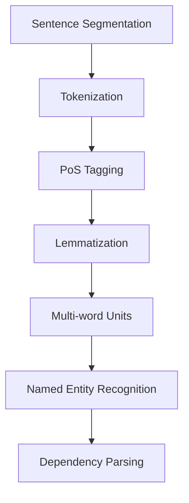

# The TPR Pipeline

The [TPR pipeline](https://github.com/Critt-Kent/TPR-DB-web-app/tree/main/libs/tpr_pipeline) extracts basic linguistic and behavioral units from the raw logging data and enriches the units with additional information. It integrates conventional monolingual Natural Language Processing (NLP) libraries ([NLTK](https://www.nltk.org/) and [Stanza](https://stanfordnlp.github.io/stanza/)), bilingual alignment tools (i.e., [SimAlign](https://github.com/cisnlp/simalign)), and custom-built components for [keystroke-to-word mapping](https://github.com/Critt-Kent/TPR-DB-web-app/blob/main/libs/tpr_pipeline/behavior/keystrokes.py) and [fixation-to-word mapping](https://github.com/Critt-Kent/TPR-DB-web-app/blob/main/libs/tpr_pipeline/behavior/gaze.py). The extracted and enriched units are stored in a `SessionProps` file for further processing. 

## Monolingual Processing

First, the source and target texts are extracted from the raw logging files and processed in a 'classical' monolingual [NLP chain](https://github.com/Critt-Kent/TPR-DB-web-app/tree/main/libs/tpr_pipeline/nlp):

The [TPR pipeline](https://github.com/Critt-Kent/TPR-DB-web-app/tree/main/libs/tpr_pipeline) starts with extracting the source and the final texts from the logging files. The texts (other than Chinese and Japanese) are then segmented, tokenized and PoS tagged using [NLTK](https://www.nltk.org/) (Natuaral Language Toolkit). Subsequently, [Stanza](https://stanfordnlp.github.io/stanza/) (Stanford NLP's neural annotation pipeline) annotation chain is applied for UPos tagging (Universal Part-of-Speech) and XPos (Pen-Treebank Pos), for lemmatization, morpho-syntactic features, multi-word token (MWT) expansion (multi-word units, or MWU), named entity recognition (NER) and dependency parsing, provided Stanza has a package for the language involved. This information is stored for the source and target texts in the `SessionProps` files under the `SourceToken` and `FinalToken`container. The Python code for these processes is [here](https://github.com/Critt-Kent/TPR-DB-web-app/blob/main/libs/tpr_pipeline/nlp/segmentation.py)

### Linguistic annotation
Tokenization segmentes the raw texts into individual tokens, while MWT expansion resolved language-specific contractions and fused forms into their constituent units — a step particularly relevant for morphologically rich languages. PoS tagging and lemmatization assign grammatical categories and canonical base forms to each token, enabling normalized frequency and complexity measures. In addition, Stanza also produces morpho-syntactic information for some languages, such as number, person, case, gender, tense, definiteness, etc. NER identifies and classifies named entities such as persons, locations, and organizations, providing a measure of referential density. Finally, dependency parsing established syntactic relationships between tokens, which can be used for tree-based measures of structural complexity such as mean dependency distance and branching factor. The [TPR pipeline](https://github.com/Critt-Kent/TPR-DB-web-app/tree/main/libs/tpr_pipeline) function [stanzaFeatures](https://github.com/Critt-Kent/TPR-DB-web-app/blob/main/libs/tpr_pipeline/nlp/segmentation.py) adds this information to each token. Together, these annotations form the basis for a rich set of linguistic product features capturing both surface form and underlying syntactic structure.

### Japanese and Chinese Sentence Segmentation and Tokenization
As Japanese and Chinese do not separate words by white spaces, we use [Stanza](https://stanfordnlp.github.io/stanza/) for Chinese tokenization and fragment the sequence of tokens into segments after one of the following characters:  '。！？.!?'. For Japanese tokenization and sentence segmentation, we use [Stanza](https://stanfordnlp.github.io/stanza/) (processors: `tokenize`, `pos`). All other languages (i.e. languages that separate words with whitespaces) we use the [NLTK](https://www.nltk.org/) function `sent_tokenize` for sentence segmentation and `word_tokenize` for word tokenization.

## Bilingual Alignment
Once the individual texts are segmented and tokenized, the TPR-DB [alignment module](https://github.com/Critt-Kent/TPR-DB-web-app/tree/main/libs/tpr_pipeline/alignment) aligns the two texts on two levels of granularity: on a segment level, the groups of source and target text segments are paired assuming they are mutual translations of each other. Subsequently individual words or groups of word (e.g., phrases) are aligned within each aligned segment pair.

### Segment-level Alignment
Currently, the [alignment module](https://github.com/Critt-Kent/TPR-DB-web-app/blob/main/libs/tpr_pipeline/alignment/aligner.py) provides a very rudimentary segment alignment heuristic. This default heuristic pairs each source segment one-to-one with a target segment in a sequential order. When one language side contains more segments than the other, all remaining segments are collapsed into the final alignment group. This rudimentary approach frequently fails and often requires manual correction.

### Word-level Alignment
Automatic word-level alignment is handled by [SimAlign](https://github.com/cisnlp/simalign), which matches words across languages without relying on traditional parallel corpora. [SimAlign](https://github.com/cisnlp/simalign) draws on pretrained multilingual language models — such as mBERT or XLM-R — to build similarity matrices between source and target words. Alignment is then determined using methods like iterative refinement and bipartite matching, which map words based on their contextual and static embedding similarities. This unsupervised approach consistently outperforms classical statistical aligners, particularly in low-resource scenarios or when working with specialized content that lacks parallel training data, provided the segment alignment is correct.

!!! note "Word-level Alignment: Manual or Automatic"

    You can choose whether to align manually or automatically, and you can always manually edit alignments after something has been aligned automatically (see [Manual Alignment](../align-annotate/manual.md)).

## Keystroke-to-word Mapping

The next step in the [TPR pipeline](https://github.com/Critt-Kent/TPR-DB-web-app/tree/main/libs/tpr_pipeline) assigns every keystroke with a likely word token that it contributes to. [Keystroke-to-word Mapping](https://github.com/Critt-Kent/TPR-DB-web-app/blob/main/libs/tpr_pipeline/behavior/keystrokes.py) associates not only insertion and deletion keystrokes, but also white spaces with a word. This allows us to assign every target text token with an edit string which contains not only the keystrokes that produced its final characters, but also the erroneous insertions and deletions that are not visible in the final text.

### Word Boundaries
[Previous TPR-DB versions](http://www.lrec-conf.org/proceedings/lrec2012/summaries/614.html) assumed that the whitespace separating two words is part of the next word. Thus the separating blank space in the sequence “to be” was taken to be part of the second word “be”. However, a recent investigation [assessing Pause Thresholds for empirical Translation Process Research](https://arxiv.org/pdf/2604.01410) of the within-word and between-word inter keystrokes intervals suggests otherwise. This assessment revealed that the distribution of inter keystroke intervals (IKI) separating the final character of a word from the following whitespace, thus, the IKI separating the two characters in “o “, is similar to within-word keystrokes, while the IKIs between a whitespace and first character of the next word (i.e., “ b”) are, on average, much longer than the within-word IKIs. We therefore consider the whitespace following a word to the part of that word, and thus the IKI to contribute to the production of the word, while the sequence whitespace - first character of next word constitutes the actual between-word IKI. 

Intuitively this makes sense when considering that a typist finishes a word by typing the word separator (whitespace) and then starts the new word, rather than starting the next word by first typing a whitespace. As a consequence of this changed word-boundary conception, not only the edit string for each word will be different in the TPR-DB 3.0 as compared to the [previous TPR-DB versions](https://drive.google.com/file/d/1FgOSNcpbjlxdo6MM_jf3Pw5wDS6S9-BB/view?usp=sharing), but also the production duration and even the mapping of fixations on words may be impacted. 

### Deletion Mapping
A key challenge in [Keystroke-to-word Mapping](https://github.com/Critt-Kent/TPR-DB-web-app/blob/main/libs/tpr_pipeline/behavior/keystrokes.py) is to determe which token a deletion keystoke should belongs to. When a translator deletes a single characters, e.g., to correct an error, those keystrokes are attributed to the word currently being corrected. However, ambiguous cases may arise when an entire word or phrase is deleted. In such cases, it may not be clear whether the associated insertions and deletions should be attributed to the word that was deleted, the word that ultimately replaced it, or the surrounding words that were affected. The current mapping strategy falls back on the sequential logic of the correction process: working backwards through the keystroke log it assigns deletion keystrokes to the nearest plausible token based on cursor position.

### Keystroke Features

Several features are derived for each token during [keystroke-to-word mapping](https://github.com/Critt-Kent/TPR-DB-web-app/blob/main/libs/tpr_pipeline/behavior/keystrokes.py). The edit string (`Edit`) captures the complete sequence of keystrokes associated with a word, where deletions are enclosed in square brackets. Production duration (`Dur`) spans the time between the first and last sequential keystrokes associated with a given token, while the pause value captures the gap between that first keystroke and the last keystroke of the preceding token — providing a measure of hesitation or planning before each word. Finally, when the interval between successive keystrokes within a token exceeds a defined threshold (`PUB`), the edit string is subdivided into smaller micro units (`MU`), each characterized by its own duration, pause, keystroke counts, and fixation data, enabling a fine-grained analysis of the writing process.

## Fixation Mapping

Once all keystrokes are associated with the tokens to which they (likely) contribute, also fixations can be mapped to the tokens. These gaze-to-word mapping functions are content of the [gaze modul](https://github.com/Critt-Kent/TPR-DB-web-app/blob/main/libs/tpr_pipeline/behavior/gaze.py) in the [TPR pipeline](https://github.com/Critt-Kent/TPR-DB-web-app/tree/main/libs/tpr_pipeline). Initially, every fixation is associated with a cursor position (i.e., character offset) in the text. [Fixations-to-word mapping](https://github.com/Critt-Kent/TPR-DB-web-app/blob/main/libs/tpr_pipeline/behavior/gaze.py) identifies the word (and word ID) that is asociated with the cursor position. [Fixations-to-word mapping](https://github.com/Critt-Kent/TPR-DB-web-app/blob/main/libs/tpr_pipeline/behavior/gaze.py) for source text tokens is straight forward, as every source text position can be associated with a static ST word Id. This is, however, different in the target text which evolves during the translation process. Fortunately, from the raw logging data we can reconstruct for every keystroke and cursor position the token Id at each timestamp (see above) which enables us to trace how the target text is modified and thus to map target text fixations on token Ids in a dynamically changing text. 

*[PoS]: part of speech
*[MWT]: multi-word token
*[NLP]: Natural Language Processing
*[NER]: named entity recognition
*[TPR]: Translation Process Research